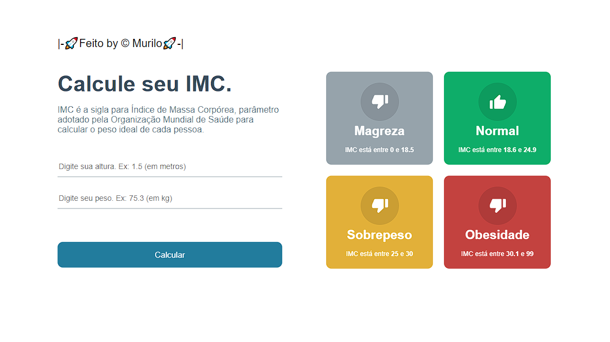

<h1 align="center">Calculadora de IMC</h1>

  <a href="#-tecnologias">Tecnologias</a>&nbsp;&nbsp;&nbsp;|&nbsp;&nbsp;&nbsp;
  <a href="#-projeto">Projeto</a>&nbsp;&nbsp;&nbsp;|&nbsp;&nbsp;&nbsp;
  <a href="#memo-licença">Licença</a>

 

  

## 🚀 Tecnologias

Esse projeto foi desenvolvido com as seguintes tecnologias:

- ReactJs
- Styled-Components
- JavaScript
- Git e Github

## 💻 Projeto

Projeto calc-imc é uma calculadora de imc feita com react

---

Feito by @MURILO 🚀